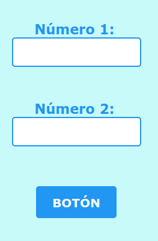
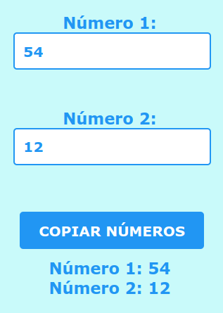
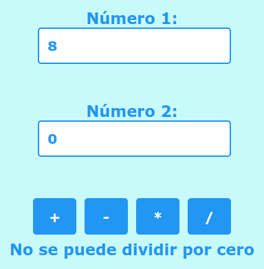

# Calculadora básica para Argentina Programa

## Organización de la Actividad
Para darle solución al proyecto que se plantea, se seguirán las pautas del Aprendizaje
Basado en Problemas, respetando el siguiente esquema:
1. Trabajar en grupo colaborativamente
2. Crear un meet para el grupo
3. Cargar la url del meet en el formulario habilitado en el campus
4. Leer detenidamente la propuesta del proyecto a realizar, y seguir las directivas del docente a cargo
5. Cumplir paso a paso con cada uno de los objetivos planteados

## Sobre el Aprendizaje Basado en Problemas
- En esta metodología el rol principal lo tiene el alumno.
- El docente actúa como facilitador, guiando y dando apoyo cuando se requiera.
- No hay introducción a los temas a abordar, por el contrario, el origen, es el planteo de un problema, que conlleva a la necesidad de investigar sobre aquellos temas desconocidos.
- Se brindan distintas fuentes de información para hacerse de los conocimientos necesarios, siendo responsabilidad del estudiante, seleccionar la que considere más conveniente.

---
# Proyecto
Implementación de una calculadora básica en HTML, CSS y JavaScript. Debe incluir dos campos numéricos y un botón para sumar, otro para restar, otro para multiplicar y finalmente uno para dividir las cifras.

**IMPORTANTE**: Una vez obtenido el objetivo deben subirse al campus los tres archivos en la actividad habilitada para ello

## Pasos
### 1. Formulario HTML con CSS
- Hacer un formulario HTML con dos campos numéricos y un botón de muestra. Dar con CSS el formato necesario.
- En este paso no es necesario dar una acción al formulario ni incluir código JavaScript.

### 2. Botón para copiar los números
- Completar un archivo .js con una función que acceda a los números de los campos del formulario (propiedad "value" del elemento "input") y los copie más abajo en un contenedor
- Esta función debe ejecutarse al presionar el botón

### 3. Botones con +, -, * y /
- Eliminar el botón del paso 2
- Crear 4 botones con las operaciones matemáticas básicas +, -, * y /
- Implementar cada operación con una función y asociarla a cada botón
- El resultado debe mostrarse más abajo en un contenedor
- Debe tenerse en cuenta que no es posible dividir por cero

## Fuentes de información
Material del curso de Argentina Programa
